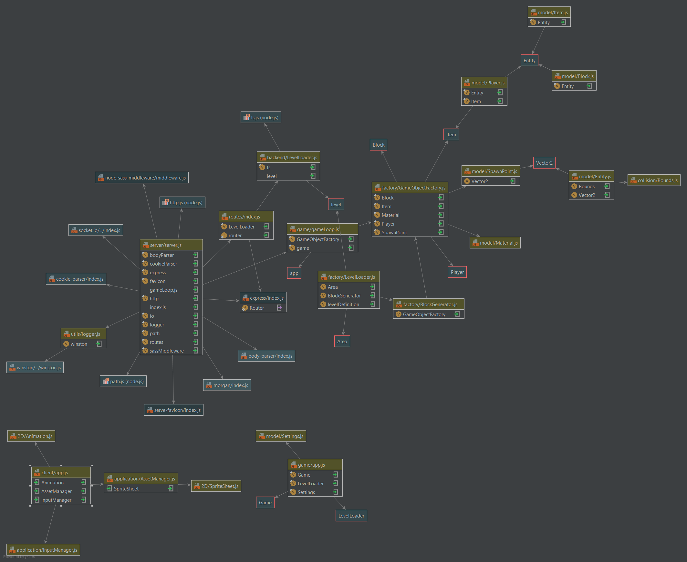

# Projekt jump-and-run (M426 - AP15a)
## Das Team
- Corrodi Cassandra
- Hill Timothy
- Peters Daniel
- Stalder Oliver
## Vision
Sidescsroller Spiel mit Plattformen und Hindernissen.  
Oberfläche mit Html5/JavaScript.
## Tools
- GitHub (Projektverwaltung)
- waffle.io (Burndownchart)
- eslint + standard.js (Code Style)
- travis.ci (Continuous Integration)
## Programmiersprachen & Frameworks
- JavaScript
- node.js
- HTML5 canvas
- pugjs templating engine
- sass
- socket.io (Updaten von Game States zwischen Server & Client)
- mocha + chai (Test Framework)
## Projekt Aufbau
